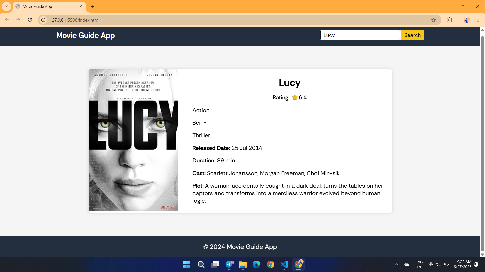
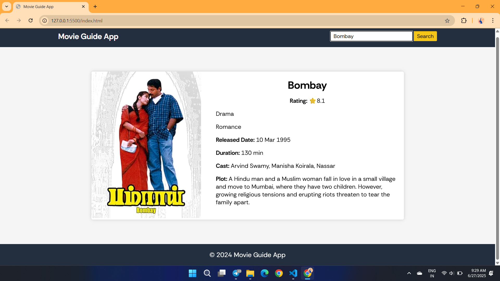

# movie-app-using-HTML-CSS-JavaScript

A **Movie Guide Web Application** built using **HTML5**, **CSS3**, and **Vanilla JavaScript**, allowing users to search for any movie and view its details using the [OMDb API](https://www.omdbapi.com/).

---

## 🚀 Features

- Dynamic search for any movie using the OMDb API
- Displays poster, title, rating, genre, cast, plot, duration, and release date
- Clean and responsive UI design
- Interactive search functionality
- Error handling for invalid or unavailable movie queries

---

## 📸 Preview

### 🖼️ Screenshot1 – Movie App Preview  

### 🖼️ Screenshot2 – Movie Search Preview  

---

## 🎥 Demo

📽️ Watch the working demo here:  
[🎬 Click to view demo](./videoRec.mp4)

---

## 📂 Project Structure
movie-app-using-HTML-CSS-JavaScript
├── index.html # Movie search markup
├── style.css # Styling for search bar, results card, layout
├── script.js # API fetch logic and DOM manipulation
├── Screenshot1.png # Preview 1
├── Screenshot2.png # Preview 2
├── demoRec.mp4 # Short demo video
└── README.md # Project documentation

## 🧠 What I Learned

- Fetching data asynchronously from an external API using `fetch`
- Dynamically manipulating the DOM with JavaScript
- Handling user input and edge cases in a web application
- Improving UI/UX using clean HTML/CSS structure
- Organizing frontend projects in a readable and modular format

---

Feel free to ⭐ the repo or fork it if you found it helpful!

